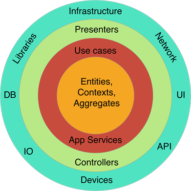

# Hexagonal architecture and Domain Driven Design

## Teeny Intro

In this article we will introduce a software architecture who implementing the DDD (Domain Driven Design) introduced by
Eric Evan in the "Bleu Book" : _Domain-Driven Design: Tackling Complexity in the Heart of Software_

When we correlate DDD and Architecture, many of us thought Microservices. But it is not the only one implementation for DDD concepte.

Hexagonal Architecture is as well good candidate for implement DDD properly and it's a very good architecture in general described by Robert C. Martin in this book: _Clean Architecture_

Forthemore, into a microservice, we need to keep good practice and good architecture too.
Even if Hexagonal Architecture was build for monolitic first, we can apply this for build our microservice well.


## What we need for following this article : 


- JDK 8 or earlier
- Maven 3+
- Any IDE or text editor


## What is DDD



Like already explained above, The Domain Drive Design was introduce by Eric Evans in 2003.
It is a Software engineering approach who keep the domain in the center of our software main set.
All the solution need to circle around the business and his terminologies.
We need to create a `Ubiquitous Language` between all stackolders (Domain team, technical teams). Each terminologies in this Language need to be found in the application.
For Exemple, if we create an appplication for following airplaine schedule, we attempt to found in the application Entity like "Airplaine" or "Travel" and Value Object like "Destination" or "Arrival".

For more informations about DDD I advice you to read this free e-book 
https://www.infoq.com/minibooks/domain-driven-design-quickly/

## Give me an Hexagone

Well, now what's the relationship with Hexagonal Arichitecture ?

When you connect DDD with Architecture, the first likeness is Microservices Architecture.
Therefore, each microservice need to be build into the bounded context.
For exemple, when you build an e-commerce, you will probably have one microservice for account management, an other for payment features and an other for stock managmement.
Every of them have only one purpose who are named in DDD bounded context.
It's what make microservice a good candidate for DDD implementation.

But it is not the only one. Like Mark Richards says about architecture decisions on his book _Fundamentals of Software Architecture_: "It's always a trad-off".
All application not be created for become a microservice.
For this type of architecture, you need to have the echosystem for managing (for exemple container management tools like Kubernetes or OpenShift for exemple) and the need of great scalability.
Each Architecture decision come with this cons. For Microservices, reliability and performance can be a challenge.

And even if you choose this way, each microservice need to have theyre own internal architecture.

So, what is exactly Hexagonal Architecture ?

It's a software architecture introduce by Alistair Cockburn in 2005. It's named " Port and Adapter Architecture " too. The purpose is, all your code about domain need to be in the same place (or module) and all about other technical purpose (like database access, APIs call or Framework like Sping in Java) need to be outside of the domain.

Like that, you can change any part of the technical detail without impact the domain.

In the DDD purpose, we want to keep attention for Domain implementation and don't care earlier about technical detail.

Like explaine in the schema below, we first have a application module (cf: app) who will use the Domain by his interfaces.
Domain implemente this exposed interfaces with this services and if this need to use external concern, like data base access, it will use others interface, named port (outbound).
The module who want to be using by the Domain, will need to implemente this interface (adapter) and mappe data between him and Domain


## Implementation

We will create a new Spring boot application with a very simple case for illustrate this architecture.

You'll found source in the reposity [Github](https://github.com/KevinDupeyrat/Hexagonal_Architecture_Article/tree/master/movies)

It's an application for get informations about movies from external public API.

we'll create one Maven project with `movies` parent and 3 sub modules like above

`````shell
movies
├───movies-app
├───movies-domain
└───movies-infra-api
`````

As you can see, we have one "main" module named `movies-app`, one Domain module named `movies-domain` and one `infra` module named `movies-infra-api`.
Each infra represent a detail about infrastructure like database access and external api call.

Because Domain only containe class with business Rules, it cannot run alone. It need some configuration and main method or other technical details for be used.

But the first rule on Hexagonal Architecture is clear :

- Domain depends of nothing. All depends of them.  

The second is : 

- You don't use directelly a infra module, you have to pass throuth domain module only.

Thats way,there is no direct dependency between two infra modules. No one has knowledge of the existence of an others

Therefore, how domain will be able to use infra-api if it not depend of them ?

## Dependencies rules


The pom.xml configuration will prevent us over accidentelly coupling between modules.

For respect dependency rules for Hexagonal Architecture you need to have the dependencies part from pom.xml of `movies-domain` like bellow :

````XML
...
    <dependencies>
        <dependency>
            <groupId>org.projectlombok</groupId>
            <artifactId>lombok</artifactId>
            <optional>true</optional>
        </dependency>
        <dependency>
            <groupId>org.junit.jupiter</groupId>
            <artifactId>junit-jupiter-api</artifactId>
            <version>5.8.2</version>
            <scope>test</scope>
        </dependency>
        <dependency>
            <groupId>org.junit.jupiter</groupId>
            <artifactId>junit-jupiter-engine</artifactId>
            <version>5.8.2</version>
            <scope>test</scope>
        </dependency>
    </dependencies>
...
````

As you can see, nothing about Spring, about persistence or external API too.
It's a emutable rule, the domain depends of nothing. Just what he need for compile (here Lombok for exemple) or testing.

So how he can use other module ?

Domain will expose some Interfaces and each infra module will implemented it. Like that, Domain just care about use his interface and don't case about who and how it will be implemented.

For dependency of all infra, we'll have to importe the domain module with scope `provide` like below :

````XML
...
<dependencies>
         ...
        <dependency>
            <groupId>com.architecture.hexagonal.exemple</groupId>
            <artifactId>movies-domain</artifactId>
            <scope>provided</scope>
        </dependency>
        ...
    </dependencies>
...
````

and for the application module `movies-app`, we'll need to importe domain and all other module like below:

````XML
...
    <dependencies>
        <dependency>
            <groupId>com.architecture.hexagonal.exemple</groupId>
            <artifactId>movies-domain</artifactId>
            <scope>provided</scope>
        </dependency>
        <dependency>
            <groupId>com.architecture.hexagonal.exemple</groupId>
            <artifactId>movies-infra-api</artifactId>
            <scope>runtime</scope>
        </dependency>
        ...
    </dependencies>
...
````

For all infra module we need to using `runtime` scope.
That disable developers to accidentelly use directly infra module in other infra module.

Sometime, infra module need to use other one. For this purpose, it need to pass through domain intead of using it directely. You shouldn't found infra dependecies in other infra module. This is the `app` who will chipboard all infra dependecies for do the link.

## Domain

So, we will start with the main important part of this project, the `Domain`.
Before start to coding, we need to stop us one minute and thinks about the `Ubiquitous Language` of our domain. In the real world, this part can take many time at the start and can evolve during all project life cicle.

What need to do our application ? Why we creating it ?

The anwser is : Movies

We want to get Movies informations like title, description, rate, director, actors ...

So start by creating our Ubiquitous Language we'll need to found in our application after.

### Ubiquitous Language

As our business domain is very easy, it will be easy to create our UL quickly, but, in real situation, that can take a few day or month before found it and every stakeholder approved and use it.

In our case, it will be something like this : 

- Movies : Represent a list of Movie
- Title  : The movie title
- Synopsys : The movie explanation with little synopsys
- Rate : The rate of the movie
- Director : Person who as create the movie
- Actors : Persons who as playing in the movie
- Release Date : Date of movie was released

the Rate need to be between 0 and 5  

## Api Movies

For this purpose, we will use the open API [TheMovieDB](https://developers.themoviedb.org/3/getting-started/introduction).

I already created an fake account for this article. The token is put on the `application-local.yml` of the project. If the token is off, you can create an account an fetch a new token : https://www.themoviedb.org/signup

Once everything is good for this API subscription, you can directly run the Spring Boot application and test it.

## Expose our own APIs

Our API expose 3 APIs who is mapped with the Movie DB with our own data model.

- GET http://localhost:8080/api/v1/movies/populars
- GET http://localhost:8080/api/v1/movies/upcoming
- GET http://localhost:8080/api/v1/movies/{{id}}

The first one give you a liste of movies sorted by popularity
The second one give you the liste of movies who are upcoming
And the last one, give you the detail aboud the movie with the id pass in path parameter.

## Architecture

For the architecture we obviously use Hexagonal Architecture with [Apache Maven](https://maven.apache.org/) for create module and build out application.

The POM configuration as already explained above dans respect the Hexagonal dependecies rules.

In the `movie-app` module we have the main class for run the Spring Boot application and our little API management exposed.  
The schema represent the architecture for better readability of the project structure.


We will explain each module bellow in more detail.

### Domain

In the domain module, we crate a pakage named `movies` who alow us to create differents domain or sub-domain part in the same bounded context. Be worry about this contexte, you need to respect it for be sur to do not mixe different domains who not allow to evolut together.  
In fact, in the same domain package you do not to find, for exemple, a domain for make coffee and an other domain for watch television.  
In this case you need to create two different domain artifect (.jar for Java).

Under this domain module, we found sub-package for managing the module, for exemple, error package for exeception managing, model package for represent the business model.  
In this model package you need to found the Ubiquitous Language.  
You have a service package too, who represent all the business logic. Everything your application needs to expose as functionnaities need to reside in this pacakge.  
And for finish, whe have a `outbound` module. This module containe all the interface used by the `service` module. That represent all functionnalities not covered by the domain, like databse access, api call ... There was thos interface who will be implemented by external infra-module.

 

### App

In the app module, we will found all you need for run your application. This is this module who orchestrate all other module.  
In is POM configuration we need to found domain module who is provided directelly and all infra module declared for be used at runtime only.  
Like domain module we found a package for error management (declaring and handling error).  
The configuration package gather all Spring Boot configuration, in our case, we have just a Bean Configuration for declare domain module service (remember, the domain don(t know everything about Spring context).  
We found to the package for the Controller for our exposed APIs too.  
And obviously, we have the main class `DemoApplication` for run our Spring Boot application. 


### Infra

Finally,we have the infra module who assemble all configuration and services for external API call.  
Under the configuration package we have all configuration about Spring and the library used for call  TheMovieDB APIs.  
An usual error management package and Service package who represente the features needed by the domain for work properly.  
The class `TheMovieDBService` implemente the domain interface `MoviesProvider` found in the `outbound` domain package. 


## Conclusion

I hope this article will helped readers to understand the fondation of the clean architecture with implementation of the DDD : Hexagonal Architecture.  
Like is already explained in this article, the architecture choise is always a trad-off and Developers or Architectes don't need to follow this implementation all the time.  
But, in fact, this architecture is a nice demonstration of a non couplige modules for better maintenability. We can change any part of the application without scare about regression in other part.  
The Domain Driven Design is better than just a new fashion pattern to follow, it's a point of view of the whole software developpement paradigm.   
The developement Team need to be focus about Domain concern instead of be entertained by all new Software new tools who evolve every days.   
When an Software team understand this, he can stand in front of any business rules challenge.
